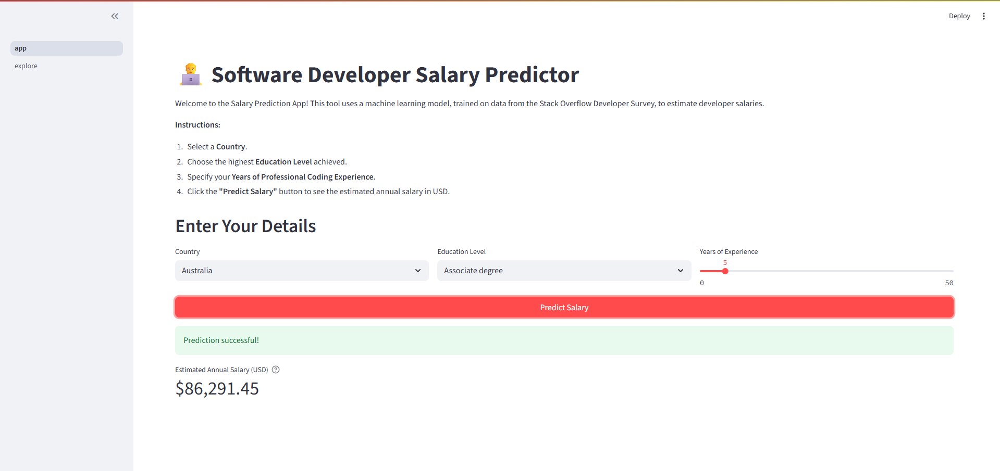
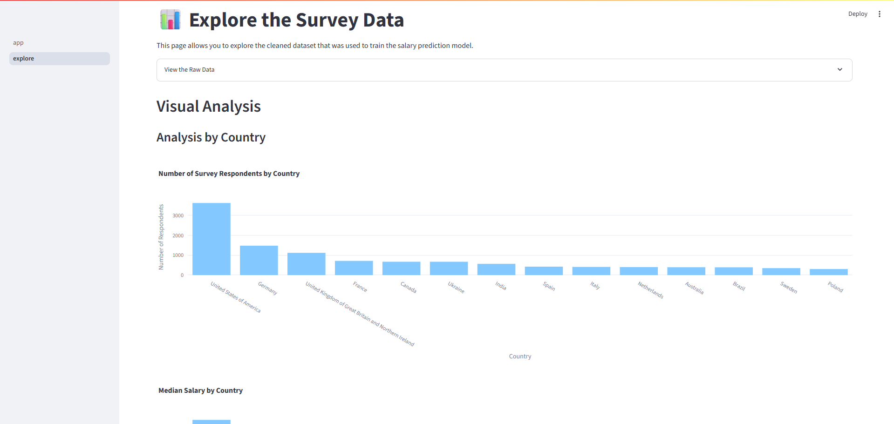
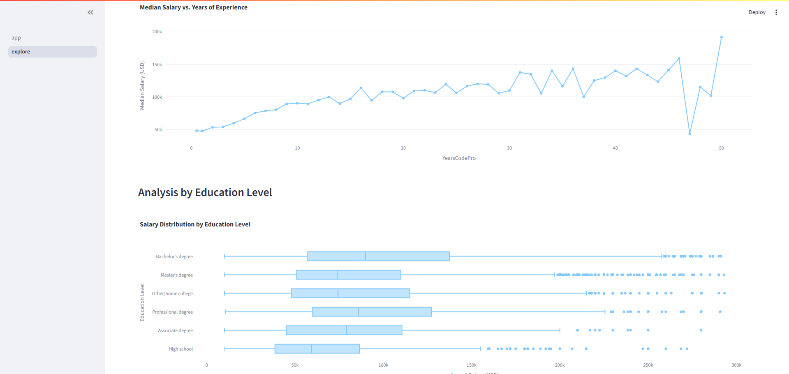
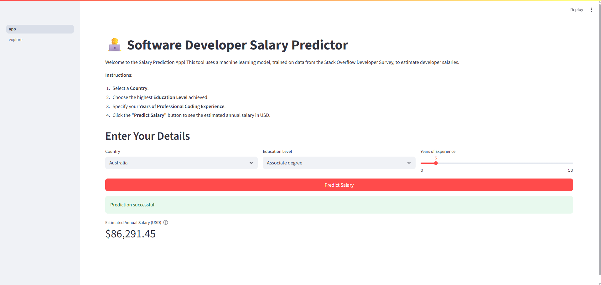

# 💼 Salary Scope Predictor

<div align="center">


_An intelligent salary prediction tool for software developers powered by machine learning_


</div>

---

## 📋 Table of Contents

- [🎯 Overview](#-overview)
- [✨ Features](#-features)
- [🏗️ Architecture](#️-architecture)
- [🔧 Installation](#-installation)
- [📖 Usage](#-usage)
- [� Screenshots](#-screenshots)
- [�📊 Data](#-data)
- [🤖 Model](#-model)
- [📱 Streamlit App](#-streamlit-app)
- [🔬 Analysis](#-analysis)
- [🤝 Contributing](#-contributing)
- [📄 License](#-license)

---

## 🎯 Overview

**Salary Scope Predictor** is a comprehensive machine learning application that predicts software developer salaries based on key factors such as location, education level, and years of experience. Built using data from the Stack Overflow Developer Survey, this tool provides accurate salary estimates to help developers make informed career decisions.

### 🌟 What makes it special?

- **Data-Driven**: Leverages real-world data from Stack Overflow's annual developer survey
- **Interactive UI**: Beautiful Streamlit web interface with modern design
- **Comprehensive Analysis**: Includes detailed exploratory data analysis and visualizations
- **Production Ready**: Clean, modular code structure with proper error handling
- **Easy Deployment**: Simple setup process with dependency management

---

## ✨ Features

### 🎯 Core Functionality

- **Salary Prediction**: Get accurate salary estimates based on your profile
- **Interactive Filters**: Filter by country, education level, and experience
- **Real-time Results**: Instant predictions with confidence indicators

### 📊 Data Exploration

- **Interactive Dashboards**: Explore salary trends across different dimensions
- **Beautiful Visualizations**: Charts and graphs using Plotly
- **Statistical Insights**: Comprehensive data analysis and patterns

### 🛠️ Technical Features

- **Machine Learning**: Random Forest regression model
- **Data Processing**: Automated data cleaning and preprocessing
- **Model Persistence**: Trained models saved for quick loading
- **Responsive Design**: Mobile-friendly interface

---

## 🏗️ Architecture

```
salary-scope-predictor/
├── 📊 Data Layer
│   ├── data/                    # Raw survey data
│   └── cleaned_data.csv         # Processed dataset
├── 🤖 Model Layer
│   ├── prepare_assets.py        # Data processing & model training
│   ├── salary_model.pkl         # Trained model artifacts
│   └── main.ipynb              # Jupyter notebook analysis
├── 🎨 Application Layer
│   ├── app.py                  # Main Streamlit application
│   └── pages/explore.py        # Data exploration dashboard
└── ⚙️ Configuration
    ├── pyproject.toml          # Project dependencies
    └── README.md               # Documentation
```

---

## 🔧 Installation

### Prerequisites

- Python 3.13 or higher
- uv package manager (recommended) or pip

### Quick Start

1. **Clone the repository**

   ```bash
   git clone https://github.com/abdellatif-laghjaj/salary-scope-predictor
   cd salary-scope-predictor
   ```

2. **Install dependencies**

   Using uv (recommended):

   ```bash
   uv sync
   ```

   Using pip:

   ```bash
   pip install -r requirements.txt
   ```

3. **Prepare the data and model**

   ```bash
   python prepare_assets.py
   ```

4. **Launch the application**

   ```bash
   streamlit run app.py
   ```

5. **Open your browser** and navigate to `http://localhost:8501`

---

## 📖 Usage

### 🎯 Making Predictions

1. **Select Your Country**: Choose from available countries in the dataset
2. **Education Level**: Select your highest level of education
3. **Years of Experience**: Use the slider to specify your professional coding experience
4. **Get Prediction**: Click the "Predict Salary" button to see your estimated salary

### 📊 Exploring Data

Navigate to the **Explore** page to:

- View salary distributions by country
- Analyze education level impact on earnings
- Explore experience vs. salary trends
- Interactive filtering and visualization

---

## 📷 Screenshots

### 🏠 Main Application Interface



### 📊 Data Exploration Dashboard




### 💰 Prediction Results



---

## 📊 Data

The application uses data from the **Stack Overflow Annual Developer Survey**, which includes:

- **Sample Size**: Thousands of developer responses worldwide
- **Features**: Country, Education Level, Years of Experience, Employment Status
- **Target**: Annual Salary (USD)
- **Data Quality**: Cleaned and preprocessed with outlier removal

### Data Processing Pipeline

1. **Raw Data Import**: Load survey results from CSV
2. **Feature Selection**: Extract relevant columns
3. **Data Cleaning**: Handle missing values and outliers
4. **Feature Engineering**: Encode categorical variables
5. **Data Validation**: Ensure data quality and consistency

---

## 🤖 Model

### Algorithm: Random Forest Regressor

- **Type**: Ensemble learning method
- **Advantages**: Handles non-linear relationships, robust to outliers
- **Features**: Country (encoded), Education Level (encoded), Years of Experience
- **Performance**: Optimized for accuracy and generalization

### Model Training Process

1. **Data Preprocessing**: Label encoding for categorical variables
2. **Feature Scaling**: Normalize numerical features
3. **Train-Test Split**: 80/20 split for validation
4. **Model Training**: Random Forest with optimized hyperparameters
5. **Model Serialization**: Save trained model for production use

---

## 📱 Streamlit App

### 🏠 Main Page (`app.py`)

- Clean, intuitive interface for salary prediction
- Real-time input validation
- Beautiful result display with metrics
- Error handling and user feedback

### 📊 Explore Page (`pages/explore.py`)

- Interactive data visualization dashboard
- Multiple chart types (histograms, scatter plots, box plots)
- Dynamic filtering capabilities
- Statistical summaries and insights

### 🎨 UI/UX Features

- **Responsive Design**: Works on desktop and mobile
- **Modern Styling**: Clean, professional appearance
- **Interactive Elements**: Sliders, dropdowns, buttons
- **Visual Feedback**: Success messages, error handling
- **Performance**: Caching for fast load times

---

## 🔬 Analysis

The project includes comprehensive analysis in `main.ipynb`:

### 📈 Exploratory Data Analysis

- Data distribution analysis
- Correlation studies
- Feature importance analysis
- Outlier detection and handling

### 📊 Visualizations

- Salary distribution by country
- Education level impact analysis
- Experience vs. salary correlation
- Geographic salary mapping

### 🎯 Model Evaluation

- Cross-validation results
- Feature importance rankings
- Prediction accuracy metrics
- Model performance analysis

---

## 🚀 Deployment

### Local Development

```bash
streamlit run app.py
```

### Production Deployment

The application can be deployed on:

- **Streamlit Cloud**: Direct deployment from GitHub
- **Heroku**: Using the provided `pyproject.toml`
- **Docker**: Containerized deployment
- **AWS/GCP/Azure**: Cloud platform deployment

---

## 🤝 Contributing

We welcome contributions! Please see our [Contributing Guidelines](CONTRIBUTING.md) for details.

### Development Process

1. Fork the repository
2. Create a feature branch (`git checkout -b feature/amazing-feature`)
3. Commit your changes (`git commit -m 'Add amazing feature'`)
4. Push to the branch (`git push origin feature/amazing-feature`)
5. Open a Pull Request

### Code Standards

- Follow PEP 8 style guidelines
- Add docstrings to functions
- Include unit tests for new features
- Update documentation as needed

---

## 📄 License

This project is licensed under the MIT License - see the [LICENSE](LICENSE) file for details.

---

## 🙏 Acknowledgments

- **Stack Overflow** for providing the developer survey data
- **Streamlit** for the amazing web app framework
- **Scikit-learn** for machine learning capabilities
- **Plotly** for interactive visualizations

---

## 📞 Contact

- **Project Maintainer**: [Abdellatif Laghjaj](mailto:abdelatiflaghjaj@gmail.com)
- **Project Link**: [https://github.com/abdellatif-laghjaj/salary-scope-predictor](https://github.com/abdellatif-laghjaj/salary-scope-predictor)

---

<div align="center">

**⭐ Star this repository if you find it helpful!**

Made with ❤️ by developers, for developers

</div>
